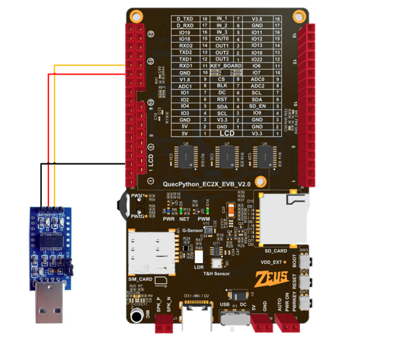
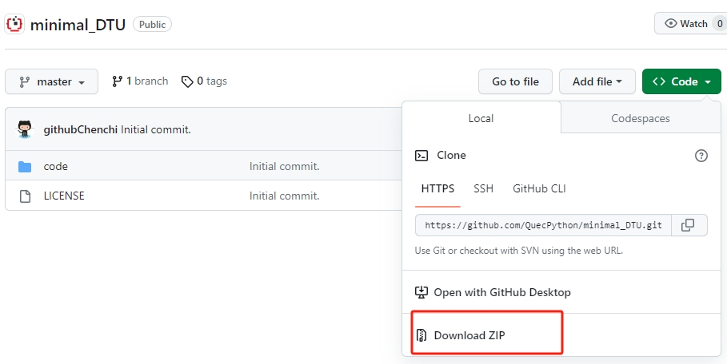
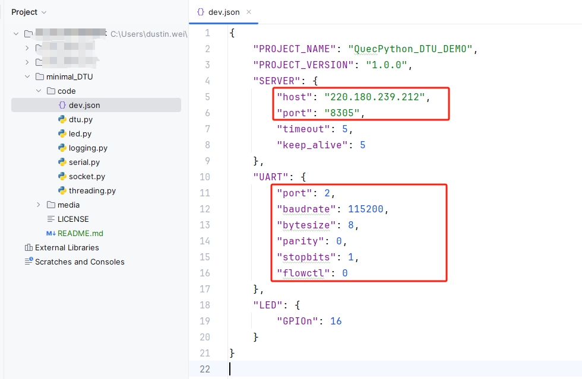
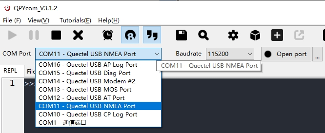
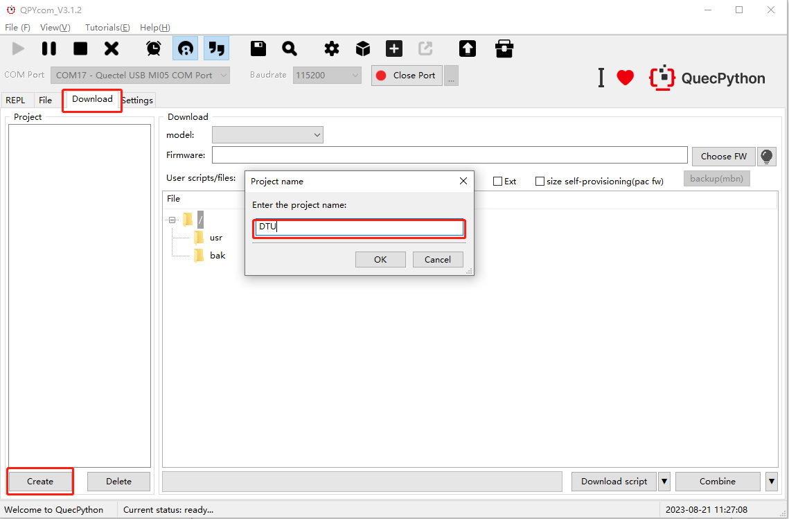
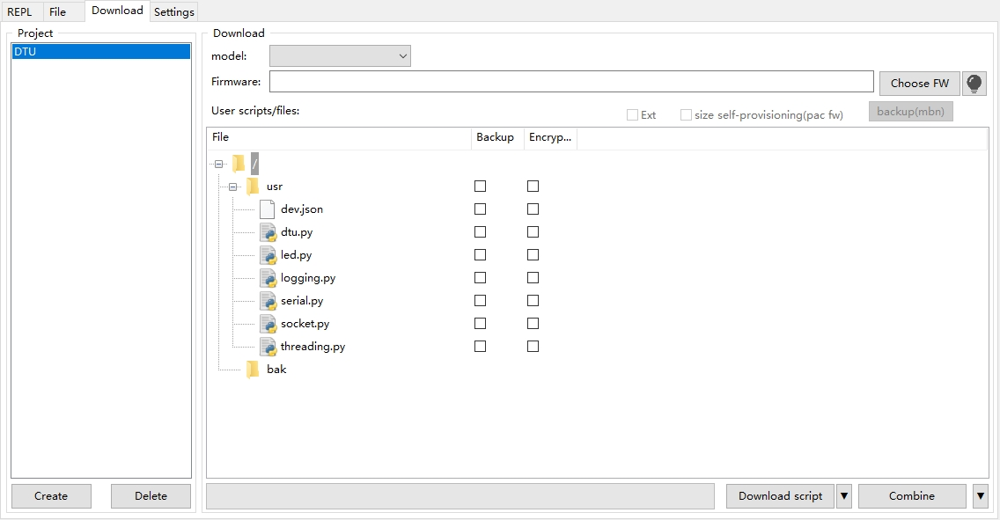
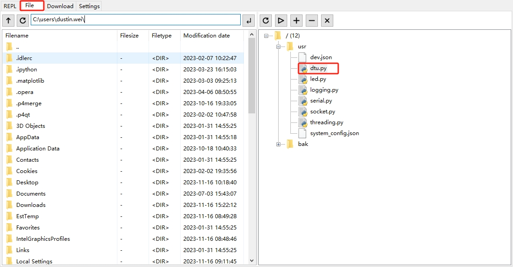
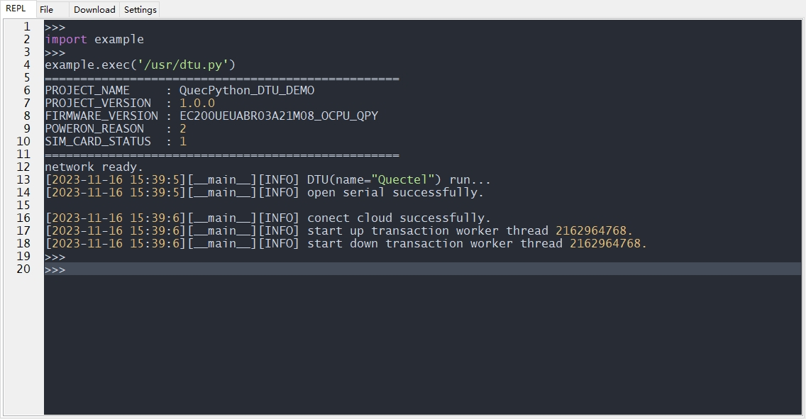
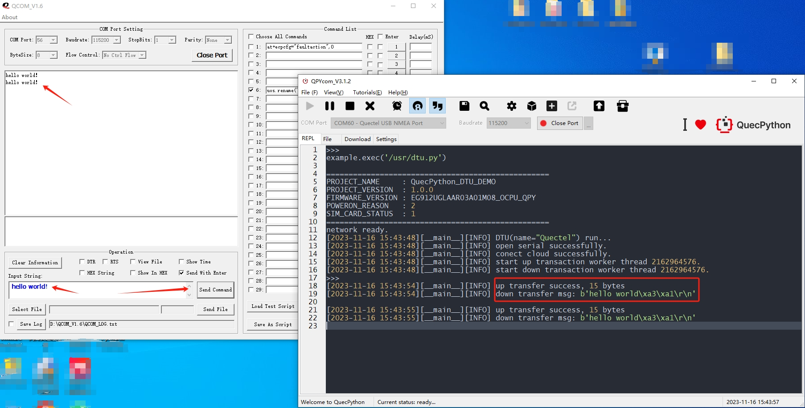

# Minimal DTU

[[English](./README.md)]

## 概述

### 简介

**Minimal DTU**是一个轻量级的数据透传单元，仅包含串口数据通过DTU模组透传至TCP服务器。本文档主要说明基于**QuecPython**平台的**Minimal DTU**的使用方式。

### 目录结构

```txt
- code
	- dev.json  # 工程配置文件
	- led.py    # led灯控制模块
	- logging   # 日志模块
	- serial.py # 串口读写模块
	- socket.py # socket客户端
	- threading.py # 线程及线程同步模块
	- dtu.py    # DTU应用主模块
```

### 配置文件

配置文件采用json格式：`dev.json`，字段详解如下：

```python
{
    "PROJECT_NAME": "QuecPython_DTU_DEMO",  # 项目名称（自定义）
    "PROJECT_VERSION": "1.0.0",  # 项目版本（自定义）
    "SERVER": {
        "host": "220.180.239.212",  # 服务器ip或域名
        "port": "8305",  # 服务器端口号
        "timeout": 5,  # tcp read timeout seconds
        "keep_alive": 5  # tcp保活包周期(分钟)
    },
    "UART": {
        "port": 2,  # QuecPython平台串口GPIO号
        "baudrate": 115200,  # 波特率
        "bytesize": 8,  # 数据位
        "parity": 0,  # 奇偶校验
        "stopbits": 1,  # 停止位
        "flowctl": 0  # 流控
    },
    "LED": {
        "GPIOn": 16  # QuecPython平台GPIO号
    }
}
```

## 操作演示

接下来我们使用搭载了`EC200U`模组的开发板 [QuecPython_EC2X_EVB_V2.0](https://python.quectel.com/doc/Getting_started/en/evb/ec2x-evb.html) 来做演示。

如下图所示，设备使用type-c给模块供电，UART与TTL转USB模块连接至开发电脑，可轻松实现调试。



| 开发板上的PIN脚 | TTL转USB模块 | 图中线的颜色 |
| --------------- | ------------ | ------------ |
| J7的13脚(TX)    | RX           | 红线         |
| J7的14脚(RX)    | TX           | 橙线         |
| J7的3脚(GND)    | GND          | 黄线         |

### 拉取代码

访问github仓库: <https://github.com/QuecPython/minimal_DTU>，选择下图`Download ZIP`下载主分支最新代码。



### 修改配置文件

代码目录`code`下`dev.json`即为配置文件，如下图所示，根据实际修改其中的`SERVER`（TCP服务器ip、域名和端口号）和`UART`（串口配置参数）配置项。



### 功能调试

参考[快速入门](https://python.quectel.com/doc/Getting_started/en/)相关文档查看开发环境搭建流程:

- 驱动[下载与安装](https://python.quectel.com/doc/Getting_started/en/driver_prepare.html)
- QPYCom [下载](./media/qpycom_download.png)与[使用](https://python.quectel.com/doc/Application_guide/en/dev-tools/QPYcom/index.html)

#### 打开repl串口



#### 下载脚本

**创建下载项目**

切换到下载选项卡，点击 `Create` 按钮，并输入任意项目名称。

此处我们创建名为`DTU`的项目。



**选择脚本文件**

1. 在 `usr` 目录上点击鼠标右键，在菜单选项中选择`一键导入`。
2. 选择我们 DTU 项目中的 `code `文件夹，并点击`确定按钮`。如下图所示：



**导入脚本文件** 

点击右下角`下载脚本`按钮，即可开始导入脚本。

#### 运行DTU应用

切换至 `File` 选项卡，在右边选中 `dtu.py`，点击运行按钮，即可开始 dtu 调试运行。

> 如果需要上电自动运行，只需要将 `dtu.py` 更名为 `main.py` 即可实现上电自动运行。



观察启动日志输出，如下图：



#### 数据透传

使用串口调试工具打开配置文件中指定的串口。模拟发送数据透传。

本文档使用的是echo服务器，即发送数据即刻回显。在当前DTU演示案例中的数据具体流向如下：

1. 通过串口调试工具发送串口数据。
2. 设备在收到数据后透传给tcp服务器。
3. tcp服务器在收到数据后回传数据。
4. 设备在收到回传数据后立刻转发至串口。
5. 串口调试工具界面可观察到透传的下行数据。



## 应用指导

### 初始化流程

参阅`code/dtu.py`

```python
if __name__ == '__main__':
    # strep1: initialize DTU Object
    dtu = DTU('Quectel')

    # step2: read json configure from json file
    dtu.config.from_json('/usr/dev.json')

    # step3: poweron print once
    checknet = checkNet.CheckNetwork(
        dtu.config['PROJECT_NAME'],
        dtu.config['PROJECT_VERSION'],
    )
    checknet.poweron_print_once()

    # step4: check network until ready
    while True:
        rv = checkNet.waitNetworkReady()
        if rv == (3, 1):
            print('network ready.')
            break
        else:
            print('network not ready, error code is {}.'.format(rv))

    # step5: dtu application run forever
    dtu.run()
    # in run method, we has below acitons:
    # step5.1: open serial
    # step5.2: connect to tcp server
    # step5.3: start up/down link thread
```

### DTU数据流

**Minimal DTU**作为一款简单的数据传输单元，仅支持串口数据纯透传TCP服务器模式。

```mermaid
sequenceDiagram
Title: Device data through processing

participant cloud as cloud
participant dtu as dtu
participant mcu as mcu

cloud -->> dtu: downlink data
loop thread
	dtu -->> mcu: downlink data
	mcu -->> dtu: uplink data
end
dtu -->> cloud: uplink data
```

应用有2个核心线程：**上行数据处理线程**、**下行数据处理线程**：

- 上行数据处理函数`uplink_transaction_handler`中负责读取串口数据转发TCP服务器。
- 下行数据处理函数`down_transaction_handler`中负责读取TCP数据转发串口。

## 文档汇总

| 文档描述                     | 链接                                                         |
| ---------------------------- | ------------------------------------------------------------ |
| QuecPython API 手册          | https://python.quectel.com/doc/API_reference/en/index.html   |
| QuecPython 入门开发教程      | https://python.quectel.com/doc/Getting_started/en/           |
| 资源下载(固件、工具、驱动等) | https://python.quectel.com/en/download                       |
| EC2X开发板介绍               | https://python.quectel.com/doc/Getting_started/en/evb/ec2x-evb.html |
| EC200U-EU模组介绍            | https://python.quectel.com/en/products/ec200u-eu             |

## 常见问题

1. **通过TTL转USB模块连接串口至PC后，QCOM串口调试工具无法接收、发送数据。**

> 通常可以采用如下方式检查：
>
> - 检查QCOM是否选择正确的端口打开。
>- 检查接线是否正确，模组RX接TTL转USB设备的TX，模组TX接TTL转USB设备的RX。
> - 应用代码配置的QuecPython串口编号选择是否正确。参阅：<https://python.quectel.com/doc/API_reference/en/QuecPython_classlib/machine.UART.html> 中针对不同的模组，开放的UART列表 。

2. **网络连接异常。**

> 可以通过`checkNet`的`waitNetworkReady`函数返回值判定，返回值代表含义详情参阅：<https://python.quectel.com/doc/API_reference/en/QuecPython_classlib/checkNet.html>。

